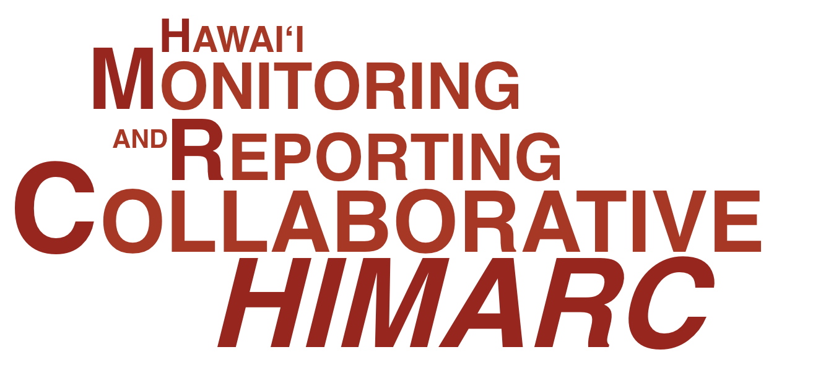

## The goal of HIMARC is to promote a collaborative approach to using science to support nearshore marine management in Hawai'i.  HIMARC maintains and updates a database that synthesizes reef fish and benthic cover survey data across different organizations.  This database has been used in the Ocean Tipping Points project  and is currently being used to help inform the Aloha+ Challenge marine initiative to sustainably manage 30% of Hawai'i's nearshore resources by 2030.

### Contact the team at himarcdb@gmail.com with questions or data requests.

### Thanks for your interest in and support of HIMARC. 
